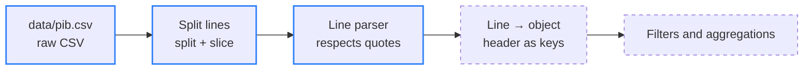

<div align="center">

# 📊 data_insights

> 🌐 Leia em [Português](./README.md)

[](#-how-it-works)

[](#️-technologies-used)

`Plain JavaScript · Node.js · 0 dependencies · MIT`

</div>

A training project for manipulating raw data in plain JavaScript, with no external libraries. The goal is to practice reading, parsing, and analyzing real-world data (CSV) from scratch, including automated tests with Vitest in the upcoming stages.

---

## 📑 Table of Contents

- [🗂️ Project Structure](#️-project-structure)
- [📦 The dataset](#-the-dataset)
- [🔄 How it works](#-how-it-works)
- [⚙️ Technologies used](#️-technologies-used)
- [🚀 How to run](#-how-to-run)
- [✨ Features](#-features)
- [🤝 Contributing](#-contributing)
- [📄 License](#-license)

---

## 🗂️ Project Structure

| Path | Description |
|---|---|
| `data/pib.csv` | Raw GDP per capita dataset by country (World Bank, indicator `NY.GDP.PCAP.CD`), in original CSV format, with no processing applied |
| `src/parser.js` | Reads the CSV and parses each line, correctly handling quoted fields that contain commas (e.g. `"Bahamas, The"`) |
| `README.en.md` | English version of this documentation |
| `LICENSE` | MIT license text |

---

## 📦 The dataset

| | |
|---|---|
| **Source** | World Bank — World Development Indicators |
| **Indicator** | GDP per capita in current US$ (`NY.GDP.PCAP.CD`) |
| **Coverage** | 265 data rows: countries and regional aggregates (e.g. *Africa Eastern and Southern*) |
| **Period** | 1960 to 2025, one column per year |
| **Last updated** | 2026-07-13 |
| **Format** | Raw CSV: 4 metadata lines before the header, `\r\n` line breaks and empty cells for years with no data |

---

## 🔄 How it works



<sub>Blue border = done · dashed border = next steps</sub>

The trickiest part is the parser. A plain `split(",")` breaks country names that contain a comma; the parser walks the line character by character and only splits fields when it is **outside** quotes:

```text
CSV line:        "Bahamas, The","BHS","GDP per capita (current US$)",...
split(","):      ['"Bahamas', ' The"', '"BHS"', ...]            ❌
parseLinesData:  ['Bahamas, The', 'BHS', 'GDP per capita (current US$)', ...]  ✅
```

---

## ⚙️ Technologies used

- JavaScript (Node.js) — no external libraries, only the built-in `fs` module
- Vitest (planned for upcoming stages)

---

## 🚀 How to run

Prerequisite: [Node.js](https://nodejs.org/) installed.

```bash
git clone https://github.com/briandevbr/data_insights.git
cd data_insights
node src/parser.js
```

At this stage, the script reads the raw dataset and prints to the console the parsed result of each line (country) already converted into an array of clean fields, with quotes removed and internal commas correctly preserved.

---

## ✨ Features

**Progress: 2 of 5 steps done**

- [x] Read the raw CSV and split it into lines
- [x] Parse each line while respecting quotes (avoiding breaking fields with internal commas)
- [ ] Convert each line into an object (key/value from the header)
- [ ] Apply filters and aggregations over the data (e.g. average GDP per country/year)
- [ ] Cover the logic with automated tests (Vitest)

---

## 🤝 Contributing

Personal training project — no external contribution process at the moment. Suggestions are welcome via [issues](https://github.com/briandevbr/data_insights/issues).

---

## 📄 License

This project is licensed under the [MIT License](./LICENSE).

---

<div align="center">
  <sub>Made by <a href="https://github.com/briandevbr">David Brian</a> · part of my backend study portfolio</sub>
</div>
