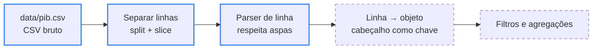

<div align="center">

# 📊 dataInsights

> 🌐 Read this in [English](./README.en.md)

[](#-como-funciona)

[](#️-tecnologias-usadas)

`JavaScript puro · Node.js · 0 dependências · MIT`

</div>

Projeto de treino para manipulação de dados brutos em JavaScript puro, sem bibliotecas externas. A ideia é praticar leitura, parsing e análise de dados reais (CSV) do zero, incluindo testes automatizados com Vitest nas próximas etapas.

---

## 📑 Sumário

- [🗂️ Estrutura do Projeto](#️-estrutura-do-projeto)
- [🗂️ Estrutura do Projeto - tree](#️-estrutura-do-projeto---tree)
- [📦 O dataset](#-o-dataset)
- [🔄 Como funciona](#-como-funciona)
- [⚙️ Tecnologias usadas](#️-tecnologias-usadas)
- [🚀 Como rodar](#-como-rodar)
- [✨ Funcionalidades](#-funcionalidades)
- [🤝 Contribuindo](#-contribuindo)
- [📄 Licença](#-licença)

---

## 🗂️ Estrutura do Projeto

| Caminho | Descrição |
|---|---|
| `data/pib.csv` | Dataset bruto de PIB per capita por país ([Banco Mundial](https://databank.worldbank.org/source/world-development-indicators), indicador [`NY.GDP.PCAP.CD`](https://data.worldbank.org/indicator/NY.GDP.PCAP.CD)), em formato CSV original, sem nenhum tratamento |
| `src/parser.js` | Leitura do CSV e parser de linha, tratando corretamente campos entre aspas que contêm vírgula (ex: `"Bahamas, The"`) |
| `README.en.md` | Versão em inglês desta documentação |
| `LICENSE` | Texto da licença MIT |

---

## 🗂️ Estrutura do Projeto - tree

```
🗂️
├── 📁 data
│  └── 📈 pib.csv
├── 📁 src
│  └── ⚙️ parser.js
├── 🗒️ LICENSE
├── 🇺🇸 README.en.md
└── 🇧🇷 README.md
```

---

## 📦 O dataset

| | |
|---|---|
| **Fonte** | [Banco Mundial — World Development Indicators](https://databank.worldbank.org/source/world-development-indicators) |
| **Indicador** | [PIB per capita em US$ correntes (`NY.GDP.PCAP.CD`)](https://data.worldbank.org/indicator/NY.GDP.PCAP.CD) |
| **Cobertura** | 265 linhas de dados: países e agregados regionais (ex: *Africa Eastern and Southern*) |
| **Período** | 1960 a 2025, uma coluna por ano |
| **Última atualização** | 2026-07-13 |
| **Formato** | CSV cru: 4 linhas de metadados antes do cabeçalho, quebras de linha `\r\n` e células vazias para anos sem dado |

---

## 🔄 Como funciona



<sub>Borda azul = pronto · borda tracejada = próximas etapas</sub>

O ponto mais delicado é o parser. Um `split(",")` simples quebra nomes de país que têm vírgula; o parser percorre a linha caractere por caractere e só separa campos quando está **fora** de aspas:

```text
Linha do CSV:    "Bahamas, The","BHS","GDP per capita (current US$)",...
split(","):      ['"Bahamas', ' The"', '"BHS"', ...]            ❌
parseLinesData:  ['Bahamas, The', 'BHS', 'GDP per capita (current US$)', ...]  ✅
```

---

## ⚙️ Tecnologias usadas

- JavaScript (Node.js) — sem bibliotecas externas, só o módulo nativo `fs`
- Vitest (planejado para as próximas etapas)

---

## 🚀 Como rodar

Pré-requisito: [Node.js](https://nodejs.org/) instalado.

```bash
git clone https://github.com/briandevbr/data_insights.git
cd data_insights
node src/parser.js
```

Neste estágio, o script lê o dataset bruto e imprime no console o resultado do parsing de cada linha (país) já convertido em array de campos limpos, sem aspas e com as vírgulas internas preservadas corretamente.

---

## ✨ Funcionalidades

**Progresso: 2 de 5 etapas concluídas**

- [x] Ler o CSV bruto e separar em linhas
- [x] Fazer o parsing de cada linha respeitando aspas (evitando quebrar campos com vírgula interna)
- [ ] Converter cada linha em objeto (chave/valor a partir do header)
- [ ] Aplicar filtros e agregações sobre os dados (ex: PIB médio por país/ano)
- [ ] Cobrir a lógica com testes automatizados (Vitest)

---

## 🤝 Contribuindo

Projeto pessoal de treino — sem processo de contribuição externa no momento. Sugestões são bem-vindas via [issues](https://github.com/briandevbr/data_insights/issues).

---

## 📄 Licença

Este projeto está sob a licença [MIT](./LICENSE).

---

<div align="center">
  <sub>Feito por <a href="https://github.com/briandevbr">David Brian</a> · parte do meu portfólio de estudos em backend</sub>
</div>
